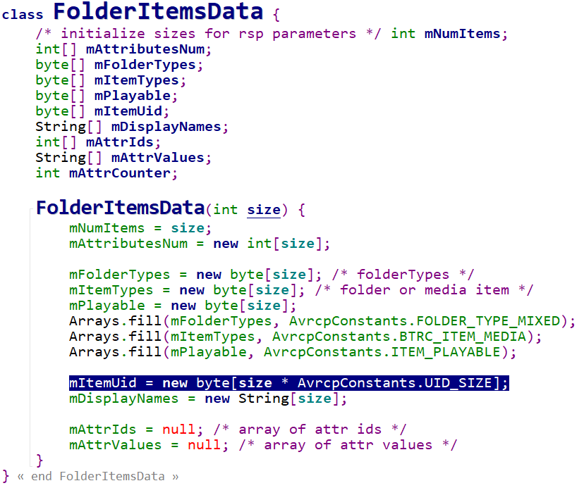

====
UID
====

Basic Concepts
==============

- Addressed Player

  The player to which the AV/C Panel Subunit shall route AV/C commands is the addressed player.

  Browsing commands with the scope **Now Playing** shall be routed via AVRCP to the Addressed Player.

- Browsed Player

  The player to which AVRCP shall route browsing commands with the scope **Virtual Media Player Filesystem or Search** is the browsed player.

- Now Playing list

  a dynamic playlist containing the media items currently scheduled to be played. The order of items in the Now Playing list supplied to the CT should reflect the order they appear on the media player application on the TG.

- UID

  Media elements are identified within the virtual filesystem by **an 8 octet identifier**, the UID.

  This allows individual items to be specified as the target of an operation.

- UID Counter

  The UID Counter allows the CT device to detect updates on the TG device. A TG device that supports the UID Counter shall update the value of the counter on each change to the media database.

  There are two different ways a Media Player on a target may handle the UID, depending on the nature of the Media Player: Database Aware (with UID change detection) and Database Unaware (without UID change detection).

  Support for UID change detection is indicated in the media player feature bitmask. Database aware players shall maintain a UID counter that is incremented whenever the database changes.

  Database Unaware Players shall always return UIDcounter=0.

UIDS
====

The UID shall be unique within a scope with the exception of the Virtual Media Player Filesystem on database unaware media players。

Within the Virtual Media Player Filesystem, a UID uniquely identifies a Media Element Item. If the same Media Element Item is present at more than one location in the Virtual Media Player Filesystem, then it may have the same UID in each location. Within the Now Playing list, a UID uniquely identifies a Media Element Item. If the same Media
 Element Item is present at more than one location in the Now Playing list, each instance shall have a different UID.

The value of ``UID=0x0`` is a special value used only to request the metadata for the currently playing media using the GetElementAttributes command and shall not be used for any item in a folder.

The UID scope is limited to one player. UID handling is specific to a player, and different players on the same TG device may behave in different ways.

FolderItemsData
===============

uid to media id mapping
=======================

..  code-block:: java

    /* store mapping between uid(Avrcp) and mediaId(Media Player) for Media Item */
    private HashMap<Integer, String> mMediaHmap = new HashMap<Integer, String>();

    /* store mapping between uid(Avrcp) and mediaId(Media Player) for Folder Item */
    private HashMap<Integer, String> mFolderHmap = new HashMap<Integer, String>();

media id is a unique persistent id for the content or null.

media id is the media id(MediaSession.QueueItem) defined from player side, uid is the media id  defined from avrcp side.

media id info from players:

.. code-block:: java

       static {
        createMediaMetadataCompat(
                "Jazz_In_Paris", //media id
                "Jazz in Paris",
                "Media Right Productions",
                "Jazz & Blues",
                "Jazz",
                103,
                TimeUnit.SECONDS,
                "jazz_in_paris.mp3",
                R.drawable.album_jazz_blues,
                "album_jazz_blues");
        createMediaMetadataCompat(
                "The_Coldest_Shoulder", //media id
                "The Coldest Shoulder",
                "The 126ers",
                "Youtube Audio Library Rock 2",
                "Rock",
                160,
                TimeUnit.SECONDS,
                "the_coldest_shoulder.mp3",
                R.drawable.album_youtube_audio_library_rock_2,
                "album_youtube_audio_library_rock_2");
        }
  
