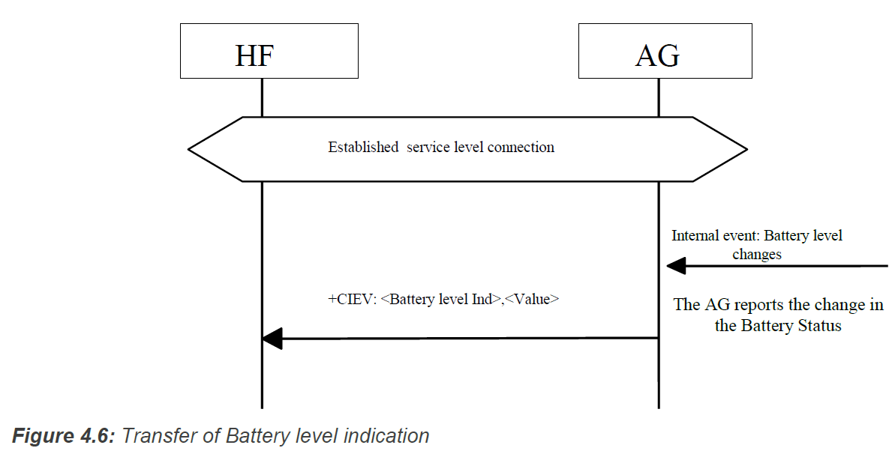
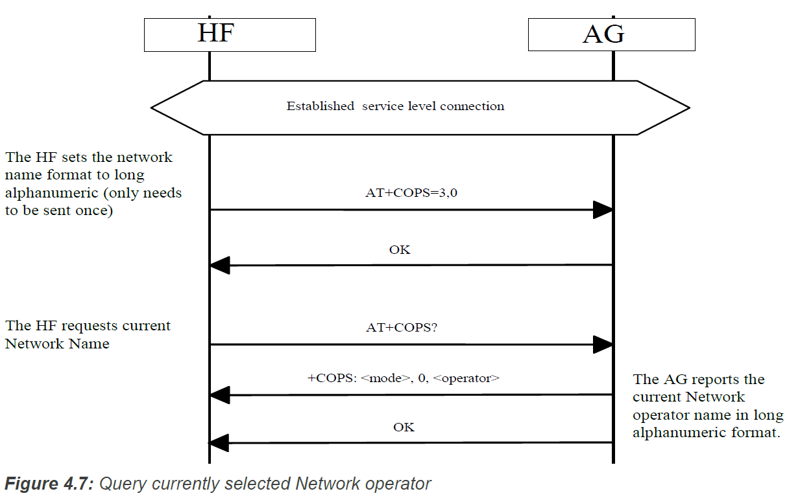
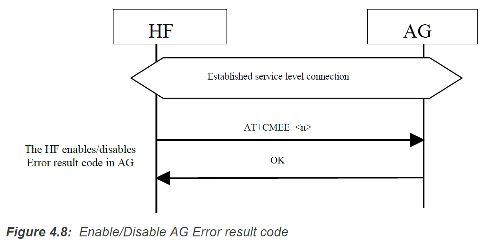
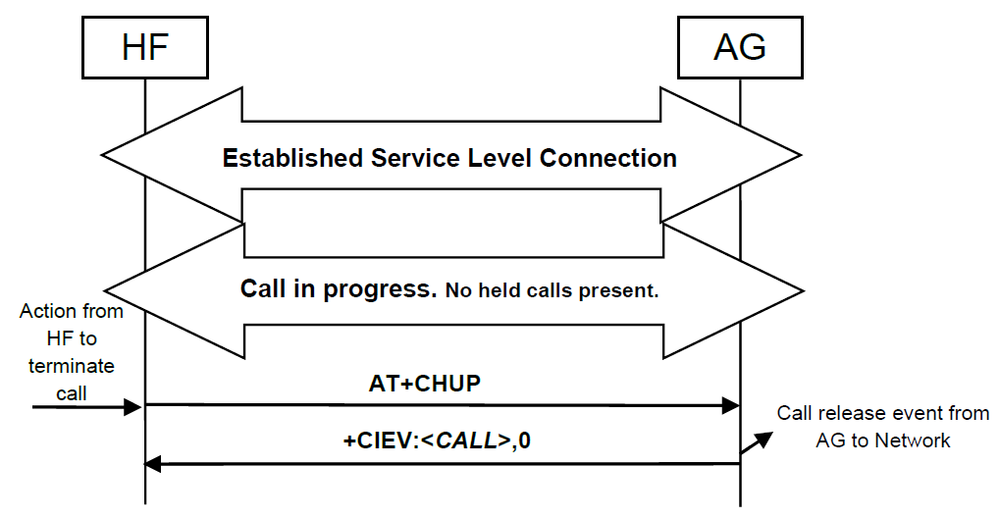
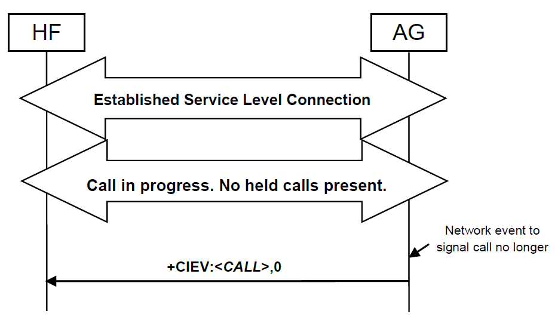
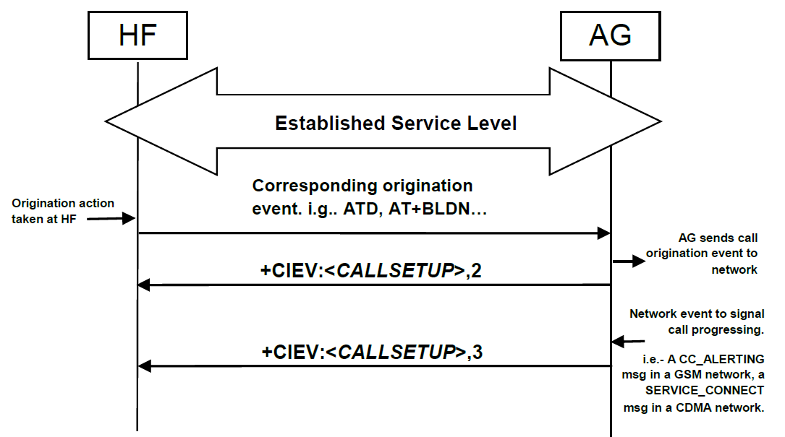
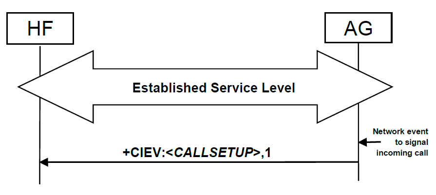
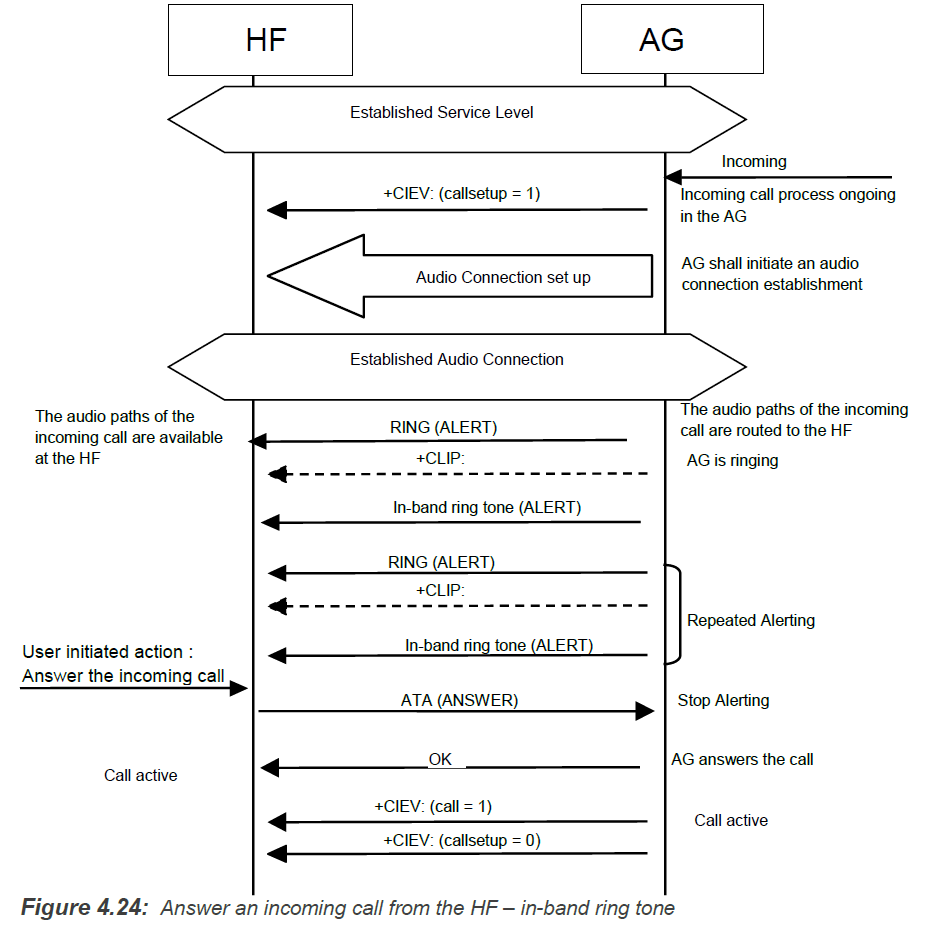
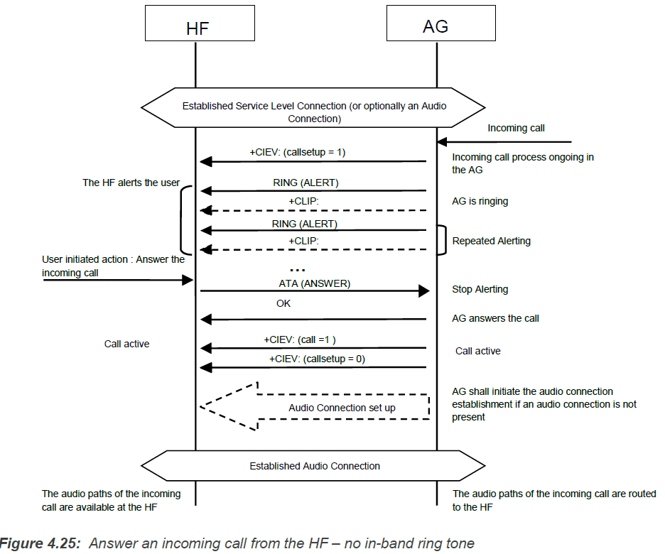
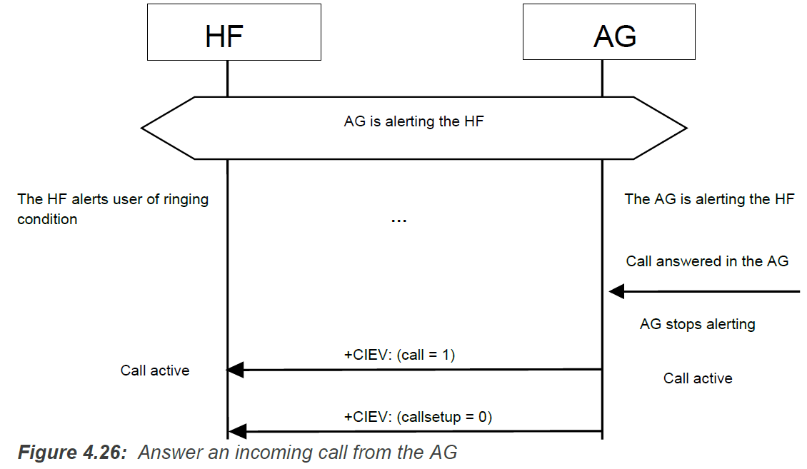

================================================
Hands-Free Control Interoperability Requirements
================================================

Connection management
=====================

Service Level Connection Establishment
--------------------------------------

Upon a user action or an internal event, either the HF or the AG may initiate a Service Level Connection establishment procedure.

A Service Level Connection establishment requires the existence of a RFCOMM connection, that is, a RFCOMM data link channel between the HF and the AG.

Service Level Connection Initialization
~~~~~~~~~~~~~~~~~~~~~~~~~~~~~~~~~~~~~~~

When an RFCOMM connection has been established, the Service Level Connection Initialization procedure shall be executed.

1. Supported features exchange

   ``AT+BRSF=<HF supported features>`` HF send this command to both notify AG the supported features in HF as well as to retrieve the supported features in GA.

   AG send ``+BRSF`` to respond.

2. Codec Negotiation

   if HF support codec negotiation feature, it shall check the ``AT+BRSF`` command response from the AG.

   if both support this feature, the HF shall send the ``AT+BAC=<HF available codecs>`` command to the AG to notify the AG of the available codecs in the HF.

   .. note::

      Legacy devices(HFP 1.5 and before) shall not indicate support for the Codec Negotiation Feature.

3. AG Indicators

   The HF uses the ``AT+CIND=?`` Test command to retrieve information about the supported indicators and their ordering.

   Once the HF has the necessary supported indicator and ordering information, it shall retrieve the current status of the indicators in the AG using the ``AT+CIND?`` Read command.

   After having retrieved the status of the indicators in the AG, the HF shall then enable the "Indicators status update" function in the AG by issuing the ``AT+CMER`` command, to which the AG shall respond with OK. the AG shall send the ``+CIEV`` unsolicited result code with the corresponding indicator value whenever a change in service, call, or call setup status occurs.

   Once the "Indicators status update" function has been enabled, the AG shall keep the function enabled until either the AT+CMER command is issued to disable it, or the current Service Level Connection between the AG and the HF is dropped for any reason.

   if the “Call waiting and 3-way calling” bit was set in the supported features bitmap by both the HF and the AG, the HF shall issue the ``AT+CHLD=?`` test command to retrieve the information about how the call hold and multiparty services are supported in the AG.

4. HF Indicators

   If both the HF and AG support the HF Indicator feature, then the HF shall send the ``AT+BIND=<HF`` supported HF indicators> command to the AG to notify the AG of the supported indicators’ assigned numbers in the HF. The AG shall respond with OK.

   the HF shall send the ``AT+BIND=?`` to request HF indicators supported by the AG. The AG shall reply with the +BIND response listing all HF indicators that it supports followed by an OK.

   Once the HF receives the supported HF indicators list from the AG, the HF shall send the ``AT+BIND?`` command to determine which HF indicators are enabled. The AG shall respond with one or more ``+BIND`` responses. The AG shall terminate the list with OK.

   From this point onwards, the HF may send the ``AT+BIEV`` command with the corresponding HF indicator value whenever a change in value occurs of an enabled HF indicator.

   The AG may enable or disable the notification of any HF indicator at any time by using the ``+BIND`` unsolicited response

5. End of Service Level Connection

   the condition in which a service level connection can be considered to be fully initialzed and thereby established.

6. Service Level Connection Diagram

   .. image:: ./images/2018070908.png

   .. image:: ./images/2018070909.png

Link Loss Recovery
~~~~~~~~~~~~~~~~~~

The HF may reconnect with the AG whenever there is loss of Bluetooth link.

When a Service Level Connection is disconnected due to explicit termination at one end (using the "Service connection release" as described in Section Service Level Connection Release), then both devices (AG and HF) shall wait for an explicit user action before an attempt is made to re-establish the Service Level Connection.

If the HF determines that the Service Level Connection was disconnected due to a link supervision timeout, then the HF may execute the "Service Level Connection establishment" procedure.

Service Level Connection Release
--------------------------------

The disconnection of a Service Level Connection shall result in the immediate removal of the corresponding RFCOMM data link channel between the HF and the AG. Also, an existing audio connection has to be removed as a consequence of the removal of the Service Level Connection. The removal of the L2CAP and link layers is optional.

      
Phone status information
========================

Transfer of Registration Status
-------------------------------

.. image:: ./images/2018070910.png

Transfer of Signal Strength Indication
--------------------------------------

The ``AT+CMER`` command enables the “Signal strength Indication” function in the AG.

The ``AT+BIA`` command allows the HF to deactivate/reactivate individual indicators.

the AG shall send the ``+CIEV`` unsolicited result code with the corresponding signal strength value whenever its signal strength changes.

If the ``CMER`` function is disabled or the indicator has been deactivated by the ``AT+BIA`` command, the AG shall not send the unsolicited result code.

.. image:: ./images/2018070911.png

Transfer of Roaming Status Indication
-------------------------------------

.. image:: ./images/2018070912.png

Transfer of Battery Level Indication of AG
------------------------------------------

Query Operator Selection
------------------------

Report Extended Audio Gateway Error Results Code
------------------------------------------------

Transfer of Call, Call Setup, and Held Call Status
--------------------------------------------------
The ``AT+CMER`` command enables the “Call Status indicators update” function in the AG.

The ``AT+BIA`` command shall have no effect on the Call, Call Setup, or Held Call indicators. These indicators cannot be deactivated using the AT+BIA command.

When the ``CMER function`` is enabled, the AG shall issue a ``+CIEV`` unsolicited result code with the corresponding call indicator and value whenever the AG's **current call status** changes. Likewise, the AG shall issue a ``+CIEV`` unsolicited result code with the corresponding callsetup indicator and value whenever the AG's **current call setup status** changes. The AG shall also issue a ``+CIEV`` unsolicited result code with corresponding callheld indicator and value whenever the AG’s **current held call status** changes.

Transfer of Call Status
~~~~~~~~~~~~~~~~~~~~~~~

Upon the change in status of any call in the AG, the AG shall execute this procedure to advise the HF of the current call status changes. The values for the call indicator are:

- 0= No calls (held or active)

- 1= Call is present (active or held)

.. image:: ./images/2018071001.png

.. image:: ./images/2018071002.png

.. image:: ./images/2018071004.png

Transfer of Callheld Status
~~~~~~~~~~~~~~~~~~~~~~~~~~~

Upon the change in AG's callsetup status, the AG shall execute this procedure to advise the HF of the current callsetup status changes. The values for the callsetup indicator are:

- 0= No call setup in progress.

- 1= Incoming call setup in progress.

- 2= Outgoing call setup in dialing state.

- 3= Outgoing call setup in alerting state.

when  a call has reached an  end-to-end  connected state, the callsetup indicator shall be reset indicating that no call setup procedures are in progress.

Indication of Status for Held Calls
~~~~~~~~~~~~~~~~~~~~~~~~~~~~~~~~~~~

Upon the change in status of any call on hold in the AG, the AG shall execute this procedure to advise the HF of the held call status. The values for the callheld indicator are:

- 0= No calls held

- 1= Call is placed on hold or active/held calls swapped(The AG has both an active AND a held call)

- 2= Call on hold, no active call

.. image:: ./images/2018071008.png

.. image:: ./images/2018071009.png

.. image:: ./images/2018071010.png

Audio Connection handling
=========================

An Audio Connection set up procedure always means the establishment of a Synchronous Connection and it is always associated with an existing Service Level Connection.

Both the initiator and the acceptor shall notify the presence of the new Audio Connection.

Audio Connection set up
-----------------------

.. image:: ./images/2018071011.png

.. image:: ./images/2018071012.png

Audio Connection release
------------------------

An Audio Connection release always means the disconnection of its corresponding Synchronous Connection.

.. image:: ./images/2018071014.png

Codec Connection set up
-----------------------

Although the Audio Connection may be triggered by either the AG or the HF, **the Codec Connection and the Synchronous Connection shall always be established by the AG** (unless one of the devices is a legacy device).

The AG shall initiate a Codec Connection only if the HF has indicated support for the Codec Negotiation feature and has sent at least one AT+BAC on the current service level connection. When selecting which codec to use for a codec connection, the AG shall use the information on codecs available in the HF as provided in the most recently received ``AT+BAC``.

.. image:: ./images/2018071013.png

Accept an incoming voice call
=============================

Answer an incoming call
-----------------------

Upon an incoming call, the AG shall send a sequence of unsolicited **RING** alerts to the HF. The **RING** alert shall be repeated for as long as the call acceptance is pending, or until the incoming call is interrupted for any reason.

If the AG's SDP record (or +BRSF message) indicates ``In-band ring tone`` is supported, the AG shall send in-band ring tones unless subsequently changed using procedures defined in Section

Answer Incoming Call from the HF – In-Band Ringing
~~~~~~~~~~~~~~~~~~~~~~~~~~~~~~~~~~~~~~~~~~~~~~~~~~

Optionally, the AG may provide an in-band ring tone.

As the figure below shows, if an in-band ring tone is used, the AG shall send the ring tone to the HF via the established Audio Connection.

Answer Incoming Call from the HF – No In-Band Ringing
~~~~~~~~~~~~~~~~~~~~~~~~~~~~~~~~~~~~~~~~~~~~~~~~~~~~~

Answer Incoming Call from the AG
~~~~~~~~~~~~~~~~~~~~~~~~~~~~~~~~

Change the In-Band Ring Tone Setting
~~~~~~~~~~~~~~~~~~~~~~~~~~~~~~~~~~~~

The SDP record entry “In-band ring tone” of the “SupportedFeatures” record informs the HF if the AG is capable of sending an in-band ring tone or not。

If the AG wants to change the in-band ring tone setting during an ongoing service level connection, it shall use the unsolicited result code ``+BSIR`` (Bluetooth Set In-band Ring tone) to notify the HF about the change.

.. image:: ./images/2018071018.png

If the HF does not want to use the AG’s in-band ring tone, it may mute the Audio Connection after it has received ``+CIEV:(callsetup=1)``. The HF shall un-mute the Audio Connection upon receiving the ``+CIEV:(callsetup=0)`` indication.

Reject an incoming voice call
=============================

Reject an Incoming Call from the HF
-----------------------------------

.. image:: ./images/2018071019.png

Rejection/Interruption of an Incoming Call in the AG
----------------------------------------------------

.. image:: ./images/2018071020.png

Terminate a call
================

Terminate a Call Process from the HF
------------------------------------

.. image:: ./images/2018071021.png

Terminate a Call Process from the AG
------------------------------------

.. image:: ./images/2018071022.png

Audio Connection transfer during an ongoing call
================================================

Place a call with a phone number supplied by the HF
===================================================

Place a call using memory dialing
=================================

Place a call to the last number dialed
======================================

Call waiting notification
=========================

Three-way calling
=================

Calling Line Identification (CLI)
=================================

Echo canceling (EC) and noise reduction (NR)
============================================

Voice recognition activation
============================

Attach a Phone number to a voice tag
====================================

Ability to transmit DTMF codes
==============================

Remote audio volume control
===========================

Respond and Hold
================

Subscriber Number Information
=============================

Enhanced Call Status
====================

Enhanced Call Controls
======================

Individual Indicator Activation
===============================

Wide Band Speech
================

Codec Negotiation
=================

HF Indicators
=============

