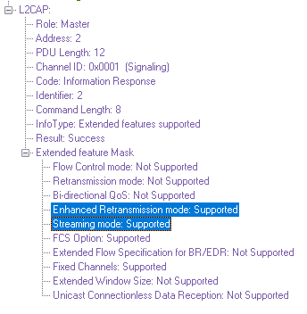

==============================================
PROCEDURES FOR FLOW CONTROL AND RETRANSMISSION
==============================================

INFORMATION RETRIEVAL
=====================

Before attempting to configure Enhanced Retransmission mode, Streaming
mode, Flow Control mode, or Retransmission mode on a channel, support for
the suggested mode shall be verified by performing an information retrieval for
the “Extended features supported” information type (0x0002). If the information
retrieval is not successful or the “Extended features mask” bit is not set for the
wanted mode, the mode shall not be suggested in a configuration request.

FUNCTION OF PDU TYPES FOR FLOW CONTROL AND RETRANSMISSION
=========================================================

Two frame formats are defined for Enhanced Retransmission mode, Streaming
Mode, Flow Control Mode, and Retransmission mode. The ``I-frame``
is used to transport user information instead of the ``B-frame``. The ``S-frame``
is used for supervision.

Information frame (I-frame)
---------------------------

I-frames are sequentially numbered frames containing information fields. Iframes
also include some of the functionality of RR frames (see below).

Supervisory Frame (S-frame)
---------------------------

The S-frame is used to control the transmission of I-frames. For
Retransmission mode and Flow Control mode, the S-frame has two formats:
``Receiver Ready (RR)`` and ``Reject (REJ)``.

S-frames are not used in Streaming mode. The following description of S-frames only
applies to Retransmission mode and Flow Control mode.

Receiver Ready (RR)
~~~~~~~~~~~~~~~~~~~

The receiver ready (RR) S-frame is used to:

1. Acknowledge I-frames numbered up to and including ReqSeq - 1.

2. Enable or disable retransmission of I-frames by updating the receiver with
   the current status of the Retransmission Disable Bit.

The RR frame has no information field.

Reject (REJ)
~~~~~~~~~~~~

The reject (REJ) S-frame is used to request retransmission of all I-frames
starting with the I-frame with TxSeq equal to ReqSeq specified in the REJ. The
value of ReqSeq in the REJ frame acknowledges I-frames numbered up to and
including ReqSeq - 1.

VARIABLES AND SEQUENCE NUMBERS
==============================

The sending peer uses the following variables and Sequence numbers:

- TxSeq – the send Sequence number used to sequentially number each new
  I-frame transmitted.

- NextTxSeq – the Sequence number to be used in the next new I-frame
  transmitted.

- ExpectedAckSeq – the Sequence number of the next I-frame expected to be
  acknowledged by the receiving peer.

The receiving peer uses the following variables and Sequence numbers:

- ReqSeq – The Sequence number sent in an acknowledgment frame to
  request transmission of I-frame with TxSeq = ReqSeq and acknowledge
  receipt of I-frames up to and including (ReqSeq-1).

- ExpectedTxSeq – the value of TxSeq expected in the next I-frame.

- BufferSeq – When segmented I-frames are buffered this is used to delay
  acknowledgment of received I-frame so that new I-frame transmissions do
  not cause buffer overflow.

All variables have the range 0 to 63.

ENHANCED RETRANSMISSION MODE
============================

Enhanced Retransmission mode operates as an HDLC balanced data link
operational mode. Either L2CAP entity may send frames at any time without
receiving explicit permission from the other L2CAP entity. A transmission may
contain single or multiple frames and shall be used for I-frame transfer and/or
to indicate status change.

Function Of PDU Types
---------------------

Enhanced Retransmission mode uses I-frames to transfer upper layer
information and S-frames for supervision.

There are four S-frames defined:

- Receiver Ready (RR)

- Reject (REJ)

- Receiver Not Ready (RNR)

- Selective Reject (SREJ)

