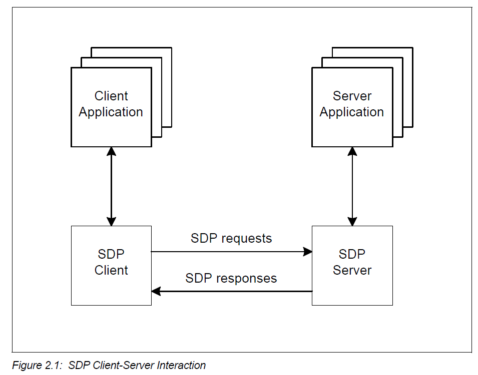
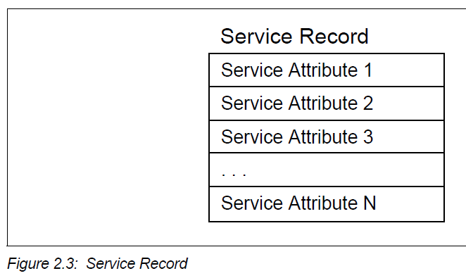

================================
SDP Specification Learning Notes
================================

OVERVIEW
========

SDP CLIENT-SERVER ARCHITECTURE
------------------------------

The service discovery mechanism provides the means for client applications to
discover the existence of services provided by server applications as well as
the attributes of those services. The attributes of a service include the type or
class of service offered and the mechanism or protocol information needed to
utilize the service.

If the client, or an application associated with the client, decides to use a
service, **it opens a separate connection** to the service provider in order to utilize
the service. SDP provides a mechanism for discovering services and their
attributes (including associated service access protocols), but it does not
provide a mechanism for utilizing those services (such as delivering the service
access protocols).

SERVICE RECORD
--------------

All of the information about a service that is maintained by an SDP server is
contained within a single service record. The service record shall only be a list
of service attributes.

A **service record handle** is a 32-bit number that shall uniquely identify each
service record within an SDP server.

An SDP server shall ensure that no service
record handle values are re-used while an L2CAP connection remains
established.

Service record handles shall remain valid across successive
L2CAP connections while the ``ServiceDatabaseState`` attribute value remains
unchanged.

A device may have a service record with a service record handle of
``0x00000000`` representing the SDP server itself. This service record contains
attributes for the SDP server and the protocol it supports. For example, one of
its attributes is the list of SDP protocol versions supported by the server.

SERVICE ATTRIBUTE
-----------------

A service attribute consists of two components: an attribute ID and an attribute
value.

.. image:: ./images/2018071103.png

- Attribute ID

  An attribute ID is a 16-bit unsigned integer that distinguishes each service
  attribute from other service attributes within a service record. The attribute ID
  also identifies the semantics of the associated attribute value.

- Attribute Value

  The attribute value is a variable length field whose meaning is determined by
  the attribute ID associated with it and by the service class of the service record
  in which the attribute is contained.

SERVICE CLASS
-------------

Each service is an instance of a service class. The service class definition
provides the definitions of all attributes contained in service records that
represent instances of that class.

Each service class is also assigned a unique identifier. This service class
identifier is contained in the attribute value for the ServiceClassIDList attribute,
and is represented as a UUID.

DATA REPRESENTATION
===================

SDP defines a simple mechanism to describe the data contained within an
attribute ID, attribute ID range, and attribute value. The primitive construct used
is the data element.

DATA ELEMENT
------------

A data element is a typed data representation. It consists of two fields:

- header

  is composed of two parts: a type descriptor and a size descriptor.

- data

  is a sequence of bytes whose length is specified in the size descriptor and
  whose meaning is (partially) specified by the type descriptor.

DATA ELEMENT TYPE DESCRIPTOR
----------------------------

A data element type is represented as a 5-bit type descriptor.

The type descriptor is contained in the most significant (high-order) 5 bits of the first byte
of the data element header. The following types have been defined.

.. image:: ./images/2018071104.png

DATA ELEMENT EXAMPLES
---------------------

.. image:: ./images/2018071105.png

PROTOCOL DESCRIPTION
====================

SDP uses a request/response model where each transaction consists of one
request protocol data unit (PDU) and one response PDU.

A client does not issue a further request to a
server prior to receiving a response to the current request before issuing
another request on the same L2CAP connection.

PROTOCOL DATA UNIT FORMAT
-------------------------

.. image:: ./images/2018071106.png

